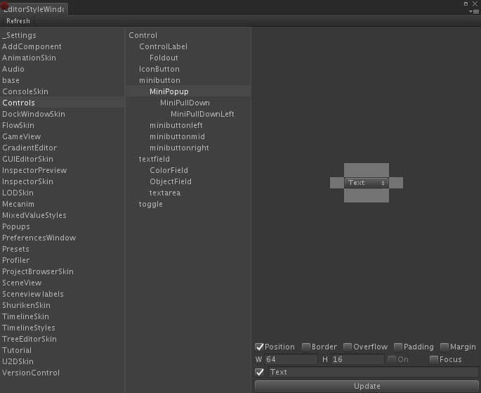
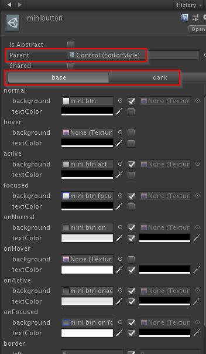
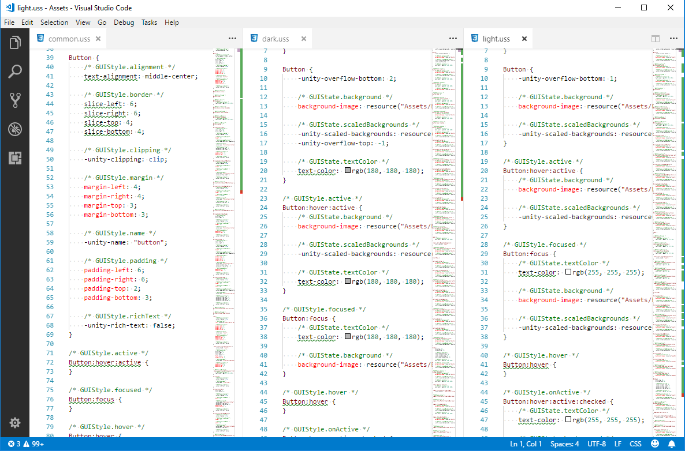
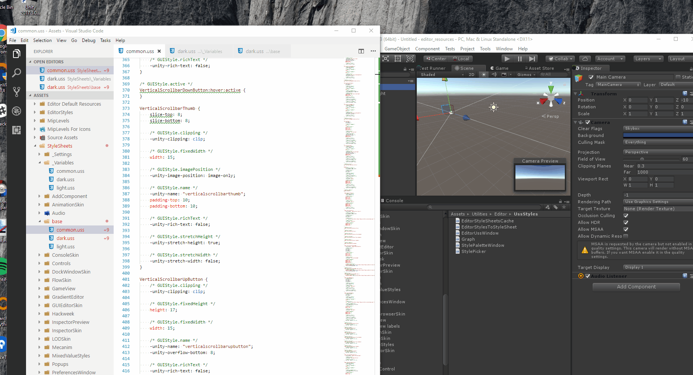
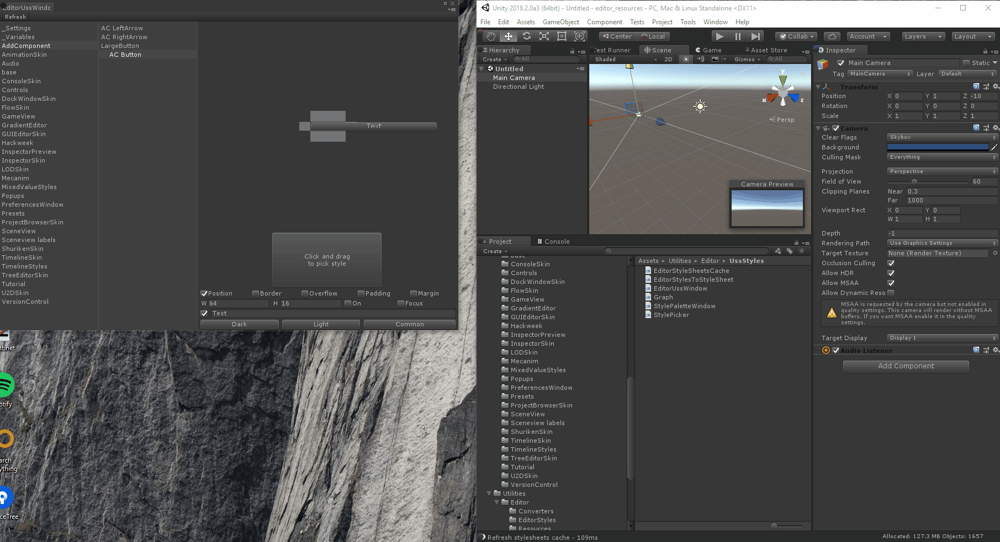
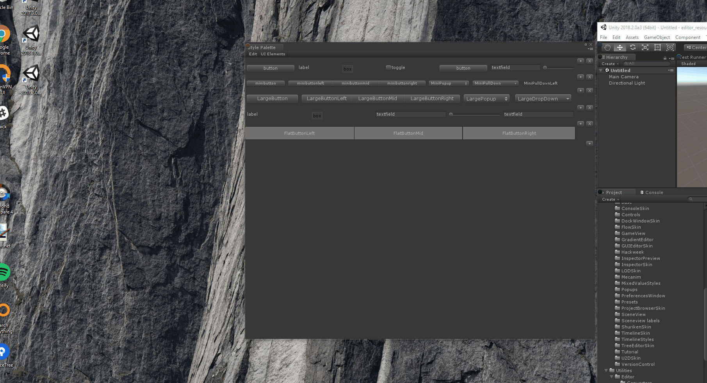

# Editor Styling

## Styling IMGUI with CSS

---

# Editor Styles
- IMGUI styling is handled with EditorStyles assets (located in the `External/Resources/editor_resources` project).
    - This means DarkSkin and LightSkin are generated from our 607 different EditorStyles.
- EditorStyles have some nice functionalities:
    - Inheritance
    - Light and Dark Style share common properties
    - EditorStyles grouped by categories (i.e folders)

---

# Editor Styles Tooling - Styles Editor

---

# Editor Styles Tooling - Inspector

---
# IMGUI and StyleSheets

- Basically we will use StyleSheets instead of EditorStyles when generating `GUISkin`
    - Use StyleSheets as file format for styling IMGUI (similar to UIElements)
- This has no impact on runtime code. IMGUI still consumes `GUISkin/GUIStyle`
- How will this impact me?
    - If you use to modify EditorStyles, you will modify StyleSheets instead
    - We have tried to provide tooling and workflows to make the transition as smooth as possible

---
# Stylesheets Workflow

- StyleSheet rules map to GUIStyle:
    - Some properties are common to IMGUI and UIElements: `width`, `height`, `font`, ...
    - Some properties are IMGUI specific: `-unity-slice-left`, ...
    - Ensure all custom properties are prefixed with `-unity-`
- We aim to have all the "advantages" of EditorStyles:
    - Same folder structure as EditorStyles
    - Each folder has a dark.uss, light.uss and common.uss file
        - common.uss contains all properties common to both light and dark skins
        - light.uss/dark.uss *mostly* differs by `text-color` and images
    - Inheritance (similar to LESS/SASS)
    - And Variables!

---
# What does a StyleSheet look like?

---
# StyleSheets Format Improvements

### Inheritance

        Label {
            text-color: rgb(180, 180, 180);
            font: resource("Lucida Grande.ttf");
            margin-top: 4;
            margin-bottom: 4;
        }

        .imgui-style-PlayerSettingsLevel {
            -unity-extend: "Label";

            /** overrides parent properties*/
            font: none;
            margin-bottom: 0;
        }

### USS Variables

        * {
            --text-color-normal: rgb(180, 180, 180);
            --text-color-light-shade: rgb(224, 224, 224);
            --text-color-lighter-shade: rgb(240, 240, 240);
        }

        .imgui-style-PlayerSettingsLevel {
            -text-color: --text-color-normal;
        }

# StyleSheets live editing

---

# StyleSheets Explorer with Style Picker

---

# StyleSheets Palette

---

# What's next

- This is the first pass. EditorStyles have been automatically converted one-to-one to StylSheets rules.
- Do a clean up of EditorStyles:
    - Remove unused styles
    - Make better use of inheritance and variable to make the StyleSheets more modular
- Harmonize IMGUI StyleSheets with UIElements to see if we can share some styling rules
